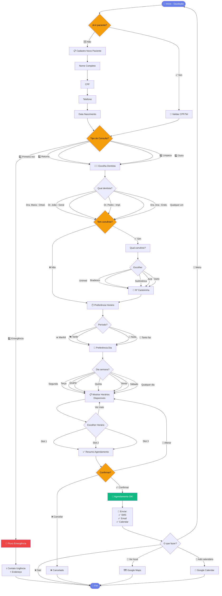

# 🗺️ Fluxograma - Chatbot Odontológico

## Visualização do Fluxo Completo de Conversação



---

## 📝 Legenda

| Cor | Significado |
|-----|-------------|
| 🟣 Roxo | Início/Fim do fluxo |
| 🟢 Verde | Sucesso (Agendamento confirmado) |
| 🔴 Vermelho | Emergência |
| 🟠 Laranja | Pontos de decisão importantes |
| ⬜ Branco | Ações e processos normais |

---

## 🔄 Fluxos Principais

### 1️⃣ Paciente Existente
```
Início → Validar CPF → Tipo Consulta → Escolher Dentista → ... → Agendamento
```

### 2️⃣ Paciente Novo
```
Início → Cadastro (4 etapas) → Tipo Consulta → Escolher Dentista → ... → Agendamento
```

### 3️⃣ Emergência
```
Início → Tipo Consulta → EMERGÊNCIA → Contato Urgente → Fim
```

---

## 📊 Estatísticas do Fluxo

- **Total de etapas:** ~15 passos
- **Tempo estimado:** 2-3 minutos
- **Pontos de decisão:** 8
- **Saídas alternativas:** 3 (Emergência, Cancelamento, Ver mapa)
- **Taxa de conclusão esperada:** 70-80%

---

## 🛠️ Como Editar

### Online (sem instalar nada):
1. Acesse [Mermaid Live Editor](https://mermaid.live)
2. Cole o código acima
3. Edite visualmente
4. Exporte como PNG/SVG/PDF

### Localmente:
1. Instale extensão Mermaid no VS Code
2. Edite este arquivo `.md`
3. Visualize em tempo real

### GitHub:
- GitHub renderiza Mermaid automaticamente
- Basta fazer commit deste arquivo
- Visualize direto no repositório

---

## 💡 Dicas de Personalização

### Adicionar novo passo:
```mermaid
NovoPasso[📝 Descrição] --> ProximoPasso
```

### Mudar cores:
```mermaid
style NovoPasso fill:#cor,color:#texto
```

### Cores disponíveis:
- `#667eea` - Roxo (Início/Fim)
- `#10b981` - Verde (Sucesso)
- `#ef4444` - Vermelho (Erro/Emergência)
- `#f59e0b` - Laranja (Decisões)
- `#3b82f6` - Azul (Informação)

---

⭐ **Dica:** Este fluxograma é 100% editável! Adapte para sua clínica.
